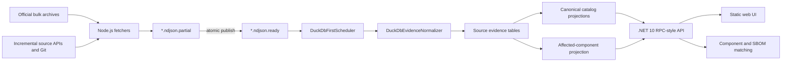

# VulTrack

VulTrack is a DuckDB-first vulnerability intelligence service. It downloads public advisory
data, preserves source evidence, resolves conservative canonical identities, projects a searchable
catalog, and exposes vulnerability, component, and SBOM workflows through a .NET API and web UI.

The project is intentionally a modular monolith. One service and one embedded database are easier
to reproduce, inspect, back up, and operate than a distributed ingestion platform for the current
read-heavy workload.

## Design Philosophy

### Evidence before projection

Fetched records are source evidence, not rows waiting to overwrite each other. VulTrack keeps each
source record, identifier, relationship, affected range, severity score, and reference separately.
The user-facing catalog is a derived projection that can be rebuilt from that evidence.

This distinction is the center of the architecture:

- `source_records` and source-owned evidence are durable truth.
- `vulnerabilities`, aliases, affected components, latest listings, and snapshots are rebuildable.
- Conflicting affected ranges remain visible instead of being silently collapsed.
- Catalog corruption is repaired by fixing the Normalizer and replaying source data, never by
  hand-editing projection tables.

### Conservative identity

CVE is the preferred canonical namespace, but only strong identity evidence may promote an
advisory to a CVE:

- A CVE record remains canonical as itself.
- A terminal embedded CVE identifier such as `DEBIAN-CVE-2026-1234` resolves to that CVE.
- An OSV, GHSA, or future BDSA record with exactly one direct CVE alias resolves to that CVE.
- An advisory with no direct CVE remains independently visible.
- An advisory with multiple direct CVEs remains independent; its CVEs are relationship evidence.
- `upstream` and `related` describe provenance and dependency, never canonical identity.

The catalog exposes relationships in both directions. An advisory shows outgoing upstream/related
links, while each target CVE shows incoming downstream evidence with source attribution.

### Reproducible bulk ingestion

Baselines come from official bulk sources whenever available: OSV `all.zip`, the GitHub Advisory
Database repository, and bulk NVD feeds. APIs are used for incremental updates, not for downloading
hundreds of thousands of baseline records one request at a time.

Bulk records and ordinary fetcher records enter the same NDJSON spool and Normalizer path. This
makes sample tests, shadow rebuilds, production replay, and scheduled updates exercise the same
code. Controlled replays can set `forceNormalize=true` to recompute records even when their source
hash has not changed.

### One writer, many readers

DuckDB is embedded and single-writer. VulTrack embraces that constraint:

- `DuckDbFirstScheduler` serializes fetch, ingest, projection, and maintenance work.
- Fetchers publish immutable completed spool files and never write DuckDB directly.
- API readers use managed read connections while all mutations pass through the evidence store.
- A failed source is isolated; invalid spool cannot terminate the API host.
- Large rebuilds are deliberate maintenance operations, not surprise scheduler behavior.

This model is a good fit for local and small-production vulnerability intelligence. It is not a
claim that DuckDB should serve write-heavy multi-instance workloads.

### Operational simplicity

Production consists of an API container, a frontend container, and a mounted DuckDB file. There is
no required PostgreSQL, Redis, message broker, external search cluster, or Kubernetes control
plane. CI publishes both `linux/amd64` and `linux/arm64` images tagged with the full commit SHA.

AI analysis is optional evidence. It is never required to build the catalog and never overrides
trusted source facts by itself.

## Architecture



### Runtime ownership

- `.NET 10` owns the API, scheduler, spool ingestion, Normalizer, catalog rebuilds, readiness,
  snapshots, AI evidence lookup, and SBOM matching.
- Node.js ESM fetchers under `plugins/fetchers/sources/` own source-specific download and parsing.
- One DuckDB file stores catalog, source evidence, affected facts, severity, references, exploits,
  threat scores, AI analyses, and SBOM data.
- Production Compose runs only `api` and `frontend`.

### Data layers

The schema is owned by `src/VulTrack.App/DuckDbEvidenceStore.Schema.cs`.

| Layer | Representative tables | Contract |
| --- | --- | --- |
| Source truth | `source_records`, `source_record_identifiers`, `source_record_relations` | Preserve source identity, provenance, and replayability. |
| Evidence | `affected_facts`, `severity_scores`, `evidence_references`, `weaknesses`, `exploits`, `threat_scores` | Keep source-level facts and disagreements. |
| Catalog | `vulnerabilities`, `vulnerability_identifiers` | Conservative canonical identity and searchable aliases. |
| Query projections | `affected_components`, `vulnerability_latest`, detail snapshots | Rebuildable, optimized views for API workflows. |
| User data | `ai_vulnerability_analyses`, `sbom_uploads`, `sbom_components`, `sbom_matches` | Preserve independently from downloadable public source data. |

`vulnerability_latest` is capped at 5,000 rows and is a latest-list materialization, not the full
catalog.

### Evidence-only distro records

Content-free `MINI-*`, `CGA-*`, and `ECHO-*` records often contain package-range evidence for a CVE
rather than an independent advisory. The Normalizer attaches their facts to a uniquely identified
CVE and suppresses the empty top-level projection. Ambiguous or unlinked records remain in source
evidence but stay out of the searchable catalog. A contentful advisory, and a CVE-less GHSA/BDSA,
remains independent. ECHO references are retained as evidence and do not by themselves make an
empty ECHO record an independent advisory.

## Ingestion Lifecycle

1. A fetcher downloads a bulk baseline or incremental update.
2. It writes NDJSON to `data/spool/incoming/*.partial`.
3. After the complete artifact is flushed, it atomically renames it to `*.ready`.
4. The scheduler drains ready files and the Normalizer replaces each source identity
   transactionally.
5. Changed canonical keys are accumulated across the cycle.
6. Affected and catalog projections rebuild once at the end of the cycle.
7. Successfully consumed spool artifacts are removed; invalid artifacts are quarantined.

Duplicate records inside one spool batch are folded by `(source_code, source_record_id)`, with the
last occurrence winning. Source-mode `append` is required for targeted bulk replays so a replay
cannot accidentally replace an entire source baseline.

Automatic baseline initialization is blocked unless `DUCKDB_ALLOW_AUTOMATIC_INIT=true`. Production
baselines should be explicit, observed, and audited before normal incremental scheduling resumes.

## Sources

The normal production source set is:

```text
nvd-cve,osv,ghsa,google-osv,cisa-kev,first-epss,exploitdb,nuclei-templates,metasploit,poc-in-github,cargo-advisory
```

CNNVD is excluded because its detail endpoint is not reliable enough for unattended production
runs. Its fetcher remains available for controlled manual investigation. GHSA incremental fetching
requires `GITHUB_TOKEN` in a host-only environment file.

See [plugins/fetchers/README.md](plugins/fetchers/README.md) for source and checkpoint contracts.

## API And UI

The API uses GET/POST RPC-style routes and a consistent result envelope:

```json
{
  "ok": true,
  "data": {},
  "requestId": "..."
}
```

Primary workflows include vulnerability search/detail, identifier and relationship navigation,
component vulnerability search, SBOM upload/matching, source administration, and read-only system
status. Search is `POST /api/v1/vulnerability.search`; admin operations use session login rather
than HTTP basic authentication.

The UI supports light/dark themes, numeric CVSS sorting, bounded relationship sections, and
bidirectional upstream/downstream navigation. It is served as static assets from the frontend
container.

## Reliability And Data Quality

- `system.health` reports process liveness.
- `system.ready` performs a real DuckDB query and returns 503 if storage cannot serve traffic.
- Fatal DuckDB invalidation is fail-stop; the scheduler does not retry destructive writes forever.
- Explicit ART indexes remain disabled while DuckDB 1.5.x persisted-index corruption under churn
  is unresolved.
- Keep one known-good database rollback and the previous image until a release has aged in.
- Never delete an active WAL, checkpoint, unknown spool file, AI backup, or SBOM without proving
  ownership and recoverability.

Run the read-only quality audit only while the API writer is stopped:

```bash
docker run --rm -i \
  -v "$PWD/data:/data:ro" \
  duckdb/duckdb:1.5.3 \
  duckdb -readonly -box /data/duckdb/vultrack.duckdb \
  < scripts/audit-duckdb-quality.sql
```

The audit checks blank and duplicate canonical IDs, alias ownership, ID/key pairing, self and
duplicate relationships, empty evidence projections, source content gaps, severity coverage, and
AI foreign-key integrity.

## Development

Requirements: Node.js 22+, Docker, and access to the .NET 10 SDK image.

```bash
cp .env.example .env
npm ci
npm run start:local
npm test
npm run lint
docker run --rm -v "$PWD:/src" -w /src \
  -v vultrack-nuget:/root/.nuget/packages \
  mcr.microsoft.com/dotnet/sdk:10.0 \
  dotnet test VulTrack.slnx
```

Open `http://localhost:3000`; the API listens on `http://localhost:5099`.

Useful source operations:

```bash
npm run fetch -- --source nvd-cve
npm run fetch:all:smoke
npm run status

# Produce an append-only forced replay from an official OSV archive.
npm run osv:bulk-prefix -- \
  --zip=data/mirrors/osv-all.zip \
  --output=data/osv-echo-replay \
  --prefix=ECHO-
```

Do not run full archive scans, multi-gigabyte DuckDB copies, or production-scale Normalizer replays
on a constrained local disk. Use the designated data/build environment and keep the production
writer stopped during controlled maintenance.

## Deployment

Production uses full commit-SHA image pins and an explicit database path:

```dotenv
VULTRACK_DUCKDB_PATH=/workspace/data/duckdb/vultrack.duckdb
VULTRACK_SCHEDULER_ENABLED=true
DUCKDB_ALLOW_AUTOMATIC_INIT=false
DUCKDB_FETCH_SOURCES=nvd-cve,osv,ghsa,google-osv,cisa-kev,first-epss,exploitdb,nuclei-templates,metasploit,poc-in-github,cargo-advisory
VULTRACK_API_IMAGE=ghcr.io/amanotooko/vultrack-api:<full-40-char-sha>
VULTRACK_FRONTEND_IMAGE=ghcr.io/amanotooko/vultrack-frontend:<full-40-char-sha>
```

Deploy only after both CI test and multi-architecture image jobs are green:

```bash
git fetch origin main
git merge --ff-only origin/main
docker compose --env-file .env.production -f docker-compose.prod.yml pull
docker compose --env-file .env.production -f docker-compose.prod.yml up -d --remove-orphans
```

Verify image identity, health, readiness, restart count, OOM state, spool state, and one complete
fetch cycle. The detailed production procedure is in
[docs/deployment/oracle-arm.md](docs/deployment/oracle-arm.md).

## Repository Map

- `src/VulTrack.App/`: .NET API, DuckDB store, scheduler, Normalizer, matching, and frontend assets
- `plugins/fetchers/`: Node.js source adapters and shared fetch/checkpoint helpers
- `scripts/`: bulk feeders, audits, deployment tools, benchmarks, and operational helpers
- `tests/`: xUnit, Node fetcher tests, and API checks
- `docs/design/`: current architecture plus clearly identified historical designs
- `docs/deployment/`: deployment and rollback runbooks
- `memory/`: concise persistent context, decisions, backlog, and instructions for coding agents

Start with [memory/README.md](memory/README.md) when continuing project work. Runtime code and schema
always override stale prose.

## Security

Never commit `.env` files, credentials, tokens, SSH keys, databases, WAL files, source dumps,
backups, or private SBOMs. Set a non-default admin password before exposing the service. Treat
tokens that appeared in logs as compromised and rotate them in host-only environment files.

## License

Apache License 2.0. See [LICENSE](LICENSE).
