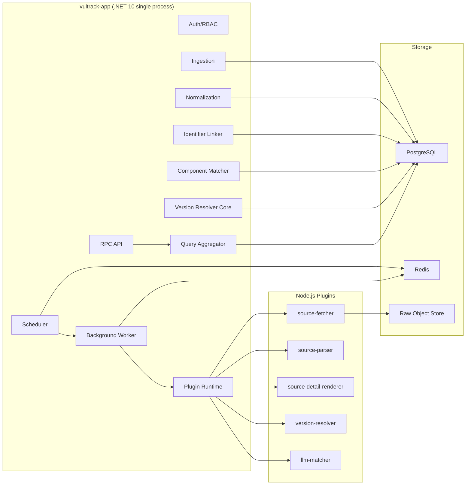

# 整体架构、工作流和业务数据流

## 1. 运行架构



## 2. 主工作流

### 2.1 Source Sync

1. Scheduler 获取 due sources。
2. 对每个 source 获取 Redis lock: `lock:source:{sourceCode}`。
3. 创建 `source_sync_runs`。
4. Plugin Runtime 调用 source fetcher。
5. fetcher 下载 feed/API/Git diff，输出 raw object 和 parsed envelope。
6. Ingestion 将 raw payload 压缩写入 object store。
7. Ingestion 写入 `source_objects` 和 `source_raw_index`。
8. parser/staging writer 写入 `stg_*` 表。
9. sync run 标记 fetched/parsed 状态。

### 2.2 Normalize

1. Normalization 扫描 `normalize_status = pending` 的 staging records。
2. 按 source schema 调用 normalizer。
3. 写入:
   - `vulnerability_records`
   - `vulnerability_severity_scores`
   - `vulnerability_descriptions`
   - `vulnerability_weaknesses`
   - `vulnerability_references`
   - `vulnerability_affected_facts`
4. 写入 identifier candidates。
5. 标记 raw index normalize status。

### 2.3 Identifier Merge

1. Identifier Linker 从 normalized facts 生成 strong/medium/weak edge。
2. strong edge 进入 union-find 合并。
3. 重算 `vulnerability_identifier_groups`。
4. 更新 `vulnerability_identifier_index.canonical_vulnerability_id`。
5. upsert `vulnerabilities` canonical row。

### 2.4 Component Match

1. 从 affected facts 抽取 PURL/CPE/package/repo identity。
2. 与 `components` 和 `component_identity_index` 匹配。
3. 写入 candidate mapping edges。
4. 对需要版本判断的 facts 调用 version resolver。
5. 聚合 `vulnerability_affected_components`。
6. 写入 `vulnerability_affected_evidence`。
7. 更新 `vulnerabilities.affected_*` 投影。

### 2.5 Detail Blocks

1. 当 source record 或 source_specific hash 变化时，投递 detail render task。
2. Runtime 调用 source-detail-renderer 插件。
3. 插件输出安全 JSON blocks。
4. 写入 `vulnerability_detail_blocks`。
5. API 详情页直接读取 blocks，不实时执行插件。

## 3. 查询数据流

### 3.1 漏洞详情

```text
GET /api/v1/vulnerability.get
  -> vulnerabilities
  -> vulnerability_identifier_index
  -> vulnerability_severity_scores where is_selected = true
  -> vulnerability_affected_components
  -> vulnerability_detail_blocks
```

### 3.2 展开证据

```text
POST /api/v1/vulnerability.affectedEvidence
  -> vulnerability_affected_evidence
  -> vulnerability_affected_facts
  -> source_raw_index metadata
```

### 3.3 SBOM/PURL Match

```text
POST /api/v1/match.purl
  -> component_identity_index exact/trgm
  -> vulnerability_affected_components by component_id
  -> version_resolver cache/plugin
  -> vulnerabilities summary
```

## 4. 幂等和失败恢复

- raw object 写入以 sha256 去重。
- `source_raw_index` 以 `(source_id, external_key, record_hash)` 去重。
- staging 以 `raw_index_id` 幂等 upsert。
- normalized facts 以 `(vulnerability_record_id, source_json_path, fact hash)` 幂等。
- identifier group 可从 identifier edges 全量重建。
- affected canonical set 可从 affected facts/evidence 全量重建。
- detail blocks 可从 source_specific/staging/raw object 重建。

