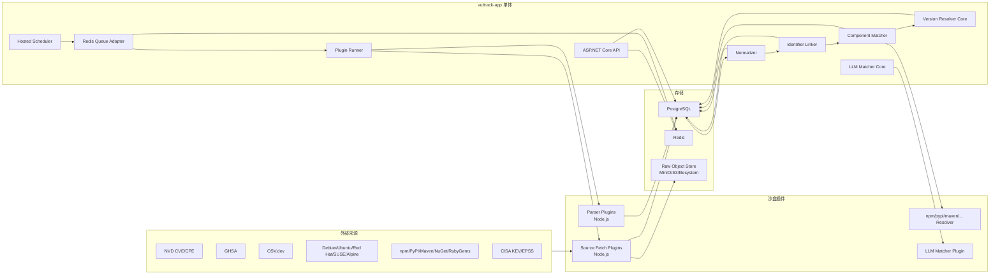
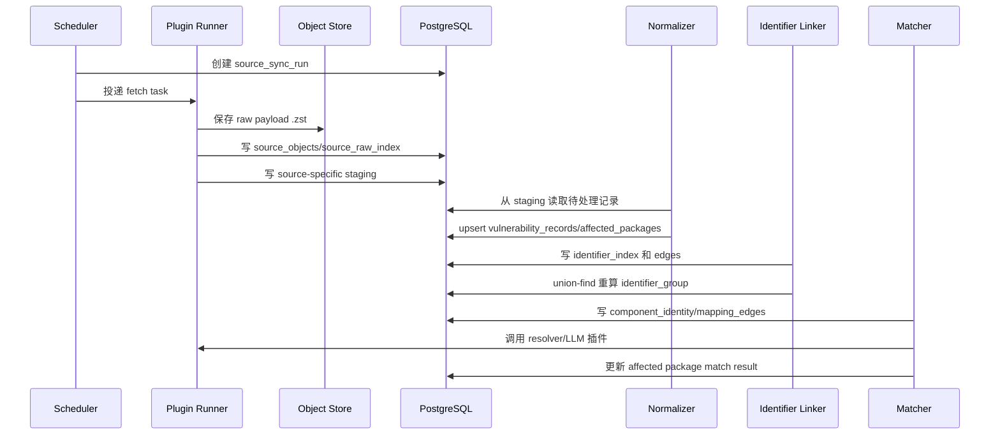

# VulTrack 漏洞追踪系统设计方案 v2

资料调研日期: 2026-05-07

本版针对第一版做收敛: 避免微服务化，暂时不引入 OpenSearch、Temporal、NATS、独立工作流系统。核心服务使用 .NET 10，采集器、解析器、版本 resolver、来源详情渲染器和 LLM matcher 以插件方式运行，PostgreSQL 承担主存储和主搜索能力，Redis 只用于队列、分布式锁、短期缓存和任务状态。

## 1. 总体目标

VulTrack 要解决四个核心问题:

- 多源漏洞数据采集: NVD、CVE List、GHSA、OSV、发行版 tracker、包管理器元数据、CISA KEV、EPSS 等。
- 漏洞身份合并: CVE、GHSA、OSV、BDSA、USN、RHSA、DSA 等不同 identifier 能快速归并到同一个 canonical vulnerability。
- 组件身份合并: PURL、CPE、包管理器名称、GitHub repo、发行版包名之间建立可审计映射。
- 可持续更新: 采集、解析、规范化、匹配、版本比对、LLM 判断都插件化和沙盒化，某个来源失败不影响核心系统。

优先级:

1. 可用性和可维护性优先。
2. 先使用 PostgreSQL 内置能力完成百万级搜索和匹配。
3. 原始数据完整保留，但不让 raw payload 拖慢业务表。
4. 关系查询走预计算索引，不在查询时递归遍历图。
5. 单体优先，容器数量尽量少。

## 2. 技术栈

推荐技术栈:

- Core App: .NET 10 LTS ASP.NET Core Web API + Hosted Service，一个进程同时承载 API、调度器、后台 worker、插件调用编排。
- ORM/Migration: EF Core + Dapper。复杂批量 upsert 和查询可用 Dapper/raw SQL。
- Plugin Runtime: Node.js + TypeScript，打包进同一个镜像，用于采集脚本、解析器、registry metadata crawler、npm/pypi/maven resolver、source detail renderer。
- Database: PostgreSQL 16+，启用 `pg_trgm`、`unaccent`、`btree_gin`、全文索引、分区表。
- Queue/Cache/Lock: Redis。
- Raw Object Store: S3/MinIO 或本地文件目录。Docker Compose 默认 MinIO，可配置为 filesystem 以减少容器。
- Frontend: 前后端分离，后续独立项目；初期 API 可托管静态构建产物。
- Observability: Serilog + OpenTelemetry logs/metrics/traces。MVP 阶段先输出 JSON log 和 `/metrics`，以后再接 Prometheus/Grafana。

不在 MVP 引入:

- OpenSearch/Meilisearch: 搜索先由 PostgreSQL 完成。
- Temporal/Hangfire/Quartz 集群工作流: 先用 .NET Hosted Service + Redis queue/lock。
- 多个微服务: 先保持模块化单体。

单服务运行方式:

- 默认只有一个 `vultrack-app` 服务进程，内部模块包括 API、Scheduler、Worker、PluginRunner、Normalizer、Matcher。
- 后台任务使用 PostgreSQL 状态表与独立调度循环，限制并发，避免同步任务拖垮 API。
- 插件通过受限子进程执行，超时、内存、stdout/stderr 大小和并发都由 .NET 核心控制。
- 后续如果数据量上来，同一个镜像可以用启动参数拆角色，例如 `--role api`、`--role worker`，但 MVP 不拆。

## 3. 最小容器部署

MVP Docker Compose:

```text
vultrack-app       # .NET API + scheduler + worker + static frontend host
postgres           # 元数据、任务状态和压缩 raw object
duckdb             # 进程内列式证据与 affected component 投影
gzip snapshots     # 漏洞详情静态缓存
```

当前精简部署:

- raw object 直接压缩写入 PostgreSQL，避免数百万小文件。
- 前端可由 `vultrack-app` 托管，不单独起 nginx。
- Node.js 插件运行时打包进 `vultrack-app` 镜像，通过子进程调用。

生产压力上来后可选拆分:

- `vultrack-app-api`
- `vultrack-app-worker`
- `vultrack-plugin-runner`

三者仍然可以用同一个镜像，只是启动命令不同。

## 4. 架构图



## 5. 数据分层

第一版把所有 raw payload 都放在 `raw_source_documents`，确实会膨胀。v2 改成四层:

1. `source_objects`: 轻量对象索引表。保存对象存储位置、hash、大小、压缩算法、schema version、状态，不保存大 payload。
2. `source_raw_index`: 原始记录索引表。保存 source、external key、发布时间、修改时间、identifier 摘要、payload hash、对象地址指针。
3. source-specific staging tables: 初步清洗后的半结构化表，例如 `stg_nvd_cves`、`stg_ghsa_advisories`、`stg_osv_vulnerabilities`、`stg_cpe_dictionary`、`stg_registry_packages`。
4. normalized business tables: `vulnerabilities`、`vulnerability_identifiers`、`components`、`affected_packages` 等业务查询表。

查询路径:

- 普通业务查询不读对象存储，也不扫 staging 大表。
- 管理员查看原文时，通过 `source_raw_index.object_id` 读取压缩对象。
- 重新解析时，从 `source_objects` 回放原始对象。

对象存储格式:

```text
raw/{source}/{yyyy}/{mm}/{dd}/{external_key_hash}.json.zst
raw/{source}/{yyyy}/{mm}/{dd}/{external_key_hash}.xml.zst
raw/{source}/{yyyy}/{mm}/{dd}/{external_key_hash}.txt.zst
```

压缩建议:

- 默认 zstd。
- 对 NVD yearly feed、CPE dictionary 这类大文件，可以保存整包对象，再在 staging 表按 record 拆分索引。
- 小对象也统一压缩，避免策略分叉。

## 6. 核心表设计

### 6.1 来源和同步

```text
sources
- id uuid pk
- code text unique
- name text
- kind text                       -- vulnerability, cpe, registry, threat_intel
- homepage_url text
- license text
- enabled bool
- plugin_name text
- plugin_version text
- config_json jsonb
- schedule_cron text
- rate_limit_json jsonb
- created_at timestamptz
- updated_at timestamptz

source_sync_runs
- id uuid pk
- source_id uuid
- status text                     -- running, succeeded, failed, partial, cancelled
- trigger text                    -- schedule, manual, retry
- checkpoint_before jsonb
- checkpoint_after jsonb
- started_at timestamptz
- finished_at timestamptz
- fetched_count int
- changed_count int
- parsed_count int
- normalized_count int
- error_count int
- log_summary text

source_task_errors
- id uuid pk
- sync_run_id uuid
- source_id uuid
- stage text                      -- fetch, parse, stage, normalize, match
- external_key text
- error_code text
- error_message text
- error_detail jsonb
- retry_count int
- next_retry_at timestamptz
- created_at timestamptz
```

### 6.2 原始对象和索引

```text
source_objects
- id uuid pk
- source_id uuid
- sync_run_id uuid
- object_uri text                 -- s3://bucket/key 或 file:///data/raw/...
- content_type text
- compression text                -- zstd, gzip, none
- sha256 text
- size_bytes bigint               -- 压缩前
- compressed_size_bytes bigint
- schema_hint text                -- nvd-cve-2.0, osv-1.7, csaf-2.0
- fetched_at timestamptz
- retention_class text            -- hot, warm, archive

source_raw_index
- id uuid pk
- source_id uuid
- sync_run_id uuid
- object_id uuid
- external_key text               -- 源内稳定 key
- external_id text                -- CVE-2024-..., GHSA-..., advisory id
- source_url text
- etag text
- last_modified_header text
- source_published_at timestamptz
- source_modified_at timestamptz
- content_hash text
- record_hash text
- record_offset jsonb             -- 大对象内的 record 位置或 json pointer
- identifier_summary text[]       -- CVE/GHSA/OSV/RHSA 等
- status text                     -- new, changed, unchanged, deleted, withdrawn
- parse_status text
- normalize_status text
- created_at timestamptz
- updated_at timestamptz
```

索引:

```sql
create unique index ux_raw_source_external_hash
  on source_raw_index(source_id, external_key, record_hash);

create index ix_raw_identifier_summary
  on source_raw_index using gin(identifier_summary);

create index ix_raw_source_modified
  on source_raw_index(source_id, source_modified_at desc);
```

### 6.3 Source-specific staging

staging 表保留“清洗过但尚未规范化”的结构，按来源拆开，避免一个巨型 raw 表容纳所有字段。

例子:

```text
stg_nvd_cves
- raw_index_id uuid pk
- cve_id text
- vuln_status text
- descriptions jsonb
- metrics jsonb
- weaknesses jsonb
- configurations jsonb
- references_json jsonb
- published_at timestamptz
- modified_at timestamptz
- cisa_exploit_add text
- cisa_action_due text

stg_ghsa_advisories
- raw_index_id uuid pk
- ghsa_id text
- cve_id text
- identifiers jsonb
- summary text
- description text
- ecosystem text
- package_name text
- vulnerable_ranges jsonb
- patched_versions jsonb
- cvss jsonb
- cwes jsonb
- references_json jsonb
- published_at timestamptz
- updated_at timestamptz

stg_osv_vulnerabilities
- raw_index_id uuid pk
- osv_id text
- aliases text[]
- related text[]
- summary text
- details text
- affected jsonb
- severity jsonb
- references_json jsonb
- published_at timestamptz
- modified_at timestamptz

stg_cpe_dictionary
- raw_index_id uuid pk
- cpe23_uri text
- part text
- vendor text
- product text
- version text
- target_sw text
- titles jsonb
- refs jsonb
- deprecated bool
- last_modified_at timestamptz
```

staging 表可以按 source 或年份分区。规范化成功后不删除，便于重建 normalized 表。

### 6.4 规范化漏洞表和最大公约数字段

`vulnerabilities` 不是来源字段全集，而是 canonical 漏洞的查询投影表。它只保存所有来源共同需要、且高频过滤/排序/列表展示的字段。任何“某来源独有、低频查看、口径不稳定”的字段都不直接加列。

`vulnerabilities` 应该保存的最大公约数:

| 字段类别 | 是否进 `vulnerabilities` | 原因 |
|---|---|---|
| 内部主键、canonical key | 是 | 所有查询和关联的锚点 |
| primary identifier | 是 | 列表和详情标题需要 |
| identifiers/aliases 数组投影 | 是 | 快速搜索和展示 |
| title/description 展示值 | 是 | 列表和详情首屏需要，但所有来源原文另存 |
| status | 是 | active/withdrawn/rejected/disputed 是全局状态 |
| published/modified/withdrawn 时间 | 是 | 过滤、排序、增量更新 |
| CVSS/severity 投影 | 是 | 列表排序和风险优先级需要 |
| EPSS/KEV 投影 | 是 | 风险优先级和过滤需要 |
| source_count/risk_score/search_text | 是 | 查询性能和展示需要 |
| 某来源特有字段 | 否 | 放到 staging、source_specific、typed properties 或渲染块 |
| 完整 CVSS metrics | 否 | 放 `vulnerability_severity_scores.metric_json` |
| 完整 references/descriptions/CWE | 否 | 放多来源事实表 |
| 受影响组件列表投影 | 是 | 详情页首屏和过滤需要，但完整证据放 affected facts |
| NVD configurations/CPE match | 否 | 放 affected/configuration 专表或 staging |
| GHSA vulnerable functions/source location | 否 | 放 affected package facts 或 typed properties |
| Red Hat product tree/remediations | 否 | 放 source-specific facts 或 typed properties |

```text
vulnerabilities
- id uuid pk
- canonical_key text unique       -- 由 identifier group 生成
- primary_identifier text
- title text
- description text
- status text                     -- active, withdrawn, disputed, rejected
- published_at timestamptz
- modified_at timestamptz
- withdrawn_at timestamptz
- max_cvss_score numeric(3,1)
- max_cvss_version text
- max_cvss_vector text
- max_cvss_source_id uuid
- severity_label text
- severity_source text
- severity_confidence numeric(4,3)
- epss_score numeric(8,7)
- epss_percentile numeric(8,7)
- kev_date_added date
- known_ransomware bool
- risk_score numeric(6,2)
- source_count int
- affected_component_count int
- affected_ecosystems text[]      -- maven, npm, pypi, cpe, deb, rpm...
- affected_component_names text[] -- openssl, log4j-core 等展示/搜索投影
- identifiers text[]              -- 查询投影字段
- aliases text[]                  -- 查询投影字段
- search_text tsvector            -- title/description/identifier/package 投影
- created_at timestamptz
- updated_at timestamptz

vulnerability_records
- id uuid pk
- vulnerability_id uuid
- source_id uuid
- raw_index_id uuid
- source_record_id text
- title text
- description text
- status text
- source_specific jsonb
- confidence numeric(4,3)
- created_at timestamptz
- updated_at timestamptz
```

特殊字段不直接加列的三种方式:

1. `vulnerability_records.source_specific`: 保存该来源规范化后仍未进入公共事实表的 JSONB。适合审计和回放，不适合高频查询。
2. `vulnerability_source_properties`: typed key-value 属性表。适合“可能被少量筛选/展示，但不值得加主表列”的字段。
3. `vulnerability_detail_blocks`: 插件生成的安全 UI 渲染块。适合详情页展示来源特色字段，例如 NVD CPE configuration 树、Red Hat product status、Ubuntu release matrix、GHSA package range 表。

typed properties 表:

```text
vulnerability_source_properties
- id uuid pk
- vulnerability_id uuid
- vulnerability_record_id uuid
- source_id uuid
- property_namespace text         -- nvd, ghsa, osv, redhat, ubuntu, debian
- property_key text               -- cisaRequiredAction, productStatus, advisoryType
- value_type text                 -- string, number, bool, date, json, string_array
- value_text text
- value_number numeric
- value_bool bool
- value_date timestamptz
- value_json jsonb
- source_json_path text
- is_queryable bool
- created_at timestamptz
- updated_at timestamptz
```

索引策略:

- 默认只索引 `(source_id, property_namespace, property_key)` 和 `(vulnerability_id)`。
- 如果某个属性变成高频过滤条件，给该 key 建 partial index。
- 如果属性变成核心业务概念，再通过 migration 晋升为 typed fact table 或 `vulnerabilities` 投影列。

例子:

```sql
create index ix_vuln_source_property_key
  on vulnerability_source_properties(source_id, property_namespace, property_key);

create index ix_vuln_source_property_redhat_product_status
  on vulnerability_source_properties(value_text)
  where property_namespace = 'redhat'
    and property_key = 'productStatus';
```

详情页插件渲染块:

```text
vulnerability_detail_blocks
- id uuid pk
- vulnerability_id uuid
- vulnerability_record_id uuid
- source_id uuid
- plugin_name text
- plugin_version text
- block_key text                  -- nvd.configurations, redhat.product_status
- block_title text
- block_type text                 -- summary, table, tree, timeline, key_value, markdown, json
- display_order int
- payload_json jsonb              -- 只允许安全组件数据，不允许任意 HTML/JS
- source_hash text
- generated_at timestamptz
- expires_at timestamptz
```

详情渲染原则:

- 插件不返回 HTML，返回结构化 JSON block，由前端内置安全组件渲染，避免 XSS。
- 渲染块在 ingest/normalize 后预生成并缓存，不在每次点击详情时实时跑插件。
- 如果 raw/staging/source_specific 变化，按 `source_hash` 失效重建。
- API 返回公共详情 + 各来源 blocks，前端按 `block_type` 渲染。
- 没有插件的来源仍可显示 `source_specific` 的 JSON viewer。

### 6.5 多来源字段兼容和 CVSS 模型

不同来源会给出不同粒度的字段。系统不能把它们强行压成一个字段，否则会丢信息。例如 NVD 可能同时给 `cvssMetricV40`、`cvssMetricV31`、`cvssMetricV30`、`cvssMetricV2`；CVE List v5 的 CNA/ADP container 也可能给多个 metrics；GHSA 可能给 GHSA 自己的 CVSS；OSV 的 `severity[]` 可能只有 `{type, score}`，其中 score 经常是 vector string；发行版 tracker 还会给 vendor severity 而不是 CVSS。

v2 使用三层兼容模型:

1. source-specific staging: 按来源完整保存清洗后的源字段，例如 `stg_nvd_cves.metrics`、`stg_osv_vulnerabilities.severity`。
2. normalized fact tables: 把可统一的事实拆成多行保存，所有来源都可以追加，不互相覆盖。
3. canonical projection: 在 `vulnerabilities` 上只保存用于排序和列表展示的投影值，例如 `max_cvss_score`、`severity_label`。

字段处理策略:

| 字段类型 | 策略 | 原因 |
|---|---|---|
| identifier | collect + group | 所有 CVE/GHSA/OSV/RHSA 等都要保留，并预计算 group |
| CVSS | collect all + projection | 多来源、多版本、多向量必须全保留，列表只投影最高或首选评分 |
| vendor severity | collect all + projection | Red Hat/Ubuntu/GHSA 等严重性口径不同，不能互相覆盖 |
| CWE/problem type | collect all | 来源可能补充不同 CWE |
| references | collect all + 去重 | URL 可重复但 tags/source 不同 |
| descriptions | collect by lang/source/type | NVD、CNA、GHSA、OSV 描述质量不同 |
| affected package/range | collect by source/ecosystem | 不同来源的版本区间可能冲突，需要保留证据 |
| fix/remediation | collect by source/product | 发行版修复版本和上游修复版本不是同一个概念 |
| exploit intel | time-series/latest | EPSS 会变化，KEV 相对稳定 |

### 6.6 受影响组件、版本范围和证据聚合

受影响组件需要分成两层:

1. source-level facts: 每个来源原样表达自己的 affected package/range/CPE/configuration，不互相覆盖。
2. canonical affected set: 后台聚合后的“当前系统认为的受影响组件和范围”，用于漏洞详情页、SBOM match、列表过滤和 API 查询。

这样能处理冲突。例如:

- Maven 来源: `pkg:maven/.../openssl` `< 1.11`
- NVD 来源: CPE 表达 `openssl = 1.11`
- LLM 根据 description 判断 `OPENSSL <= 1.11`

三者不能粗暴覆盖。正确做法是 source facts 全部保存，然后 canonical affected set 生成一个候选结论，例如 `<= 1.11`，同时把 Maven/NVD/LLM 都作为 evidence 挂到该结论上，并标记 conflict/置信度。

source-level affected facts:

```text
vulnerability_affected_facts
- id uuid pk
- vulnerability_id uuid
- vulnerability_record_id uuid
- source_id uuid
- raw_index_id uuid
- fact_type text                  -- purl, cpe, package_name, repo, distro_package
- ecosystem text                  -- maven, npm, pypi, cpe, deb, rpm, generic
- package_namespace text
- package_name text
- normalized_package_name text
- purl text
- purl_without_version text
- cpe23_uri text
- component_id uuid               -- 匹配到组件后填写
- version_range_raw text
- range_type text                 -- semver, maven, pep440, rpm, deb, cpe_match, exact, unknown
- introduced text
- fixed text
- last_affected text
- limit_version text
- affected_versions jsonb
- fixed_versions jsonb
- vulnerable bool
- source_confidence numeric(4,3)
- source_json_path text
- source_specific jsonb
- created_at timestamptz
- updated_at timestamptz
```

canonical affected set:

```text
vulnerability_affected_components
- id uuid pk
- vulnerability_id uuid
- component_id uuid
- ecosystem text
- package_name text
- display_name text
- primary_purl text
- primary_cpe23_uri text
- normalized_range text           -- 例如 <1.11, <=1.11, [1.0,1.11]
- range_type text
- introduced text
- fixed text
- last_affected text
- affected_versions jsonb
- fixed_versions jsonb
- confidence numeric(4,3)
- resolution_status text          -- confirmed, candidate, conflicted, rejected, needs_review
- conflict_flag bool
- evidence_count int
- evidence_summary text
- selected_by_rule text           -- strictest, majority, trusted_source, manual, llm_assisted
- created_at timestamptz
- updated_at timestamptz
```

evidence 聚合表:

```text
vulnerability_affected_evidence
- id uuid pk
- affected_component_id uuid
- affected_fact_id uuid
- source_id uuid
- evidence_kind text              -- source_fact, resolver_result, llm_inference, manual_review
- evidence_value jsonb
- confidence numeric(4,3)
- supports_conclusion bool
- conflict_reason text
- created_at timestamptz
```

LLM 结果不是直接写 final range，而是写成一种 evidence:

```json
{
  "evidence_kind": "llm_inference",
  "evidence_value": {
    "component": "openssl",
    "range": "<=1.11",
    "reason": "description says versions up to and including 1.11 are affected",
    "citedSpans": []
  },
  "confidence": 0.72
}
```

affected projection 规则:

- `vulnerabilities.affected_ecosystems` 和 `affected_component_names` 只做列表搜索/展示投影。
- 详情页默认查询 `vulnerability_affected_components`，一次拿到 canonical 组件列表。
- 用户展开某个组件时，再查询 `vulnerability_affected_evidence` 查看 Maven/NVD/LLM/人工审核证据。
- SBOM match 只读 canonical affected set，不扫每个来源 fact。
- 当 source facts 或 component mapping 变化时，后台重算 canonical affected set，并更新 `vulnerabilities` 上的投影字段。

冲突处理规则:

- trusted source 优先: 官方生态 advisory 或厂商 CSAF 权重高于描述抽取。
- range 合并要按生态 resolver 判断，不用字符串拼接。
- `< 1.11` 与 `= 1.11` 不自动合成 `<= 1.11`，除非有强证据或 LLM/人工证据达到阈值；否则标记 `conflicted`。
- LLM 只增加 `llm_inference` evidence 和候选分数，不能单独把 `resolution_status` 改成 `confirmed`。
- 人工审核可以锁定 canonical range，后续来源更新只生成 conflict 提醒，不自动覆盖。

查询优化:

```sql
create index ix_affected_components_vuln
  on vulnerability_affected_components(vulnerability_id, ecosystem, display_name);

create index ix_affected_components_component
  on vulnerability_affected_components(component_id, vulnerability_id);

create index ix_affected_facts_vuln
  on vulnerability_affected_facts(vulnerability_id, ecosystem, normalized_package_name);

create index ix_affected_evidence_component
  on vulnerability_affected_evidence(affected_component_id);
```

详情页一次查询模型:

```text
GET /api/vulnerabilities/{id}
  -> vulnerabilities
  -> selected severity/identifiers
  -> vulnerability_affected_components
  -> vulnerability_detail_blocks

GET /api/vulnerabilities/{id}/affected-components/{affectedComponentId}/evidence
  -> vulnerability_affected_evidence
```

CVSS 和严重性表:

```text
vulnerability_severity_scores
- id uuid pk
- vulnerability_id uuid
- vulnerability_record_id uuid
- source_id uuid
- raw_index_id uuid
- scoring_system text             -- cvss, vendor, epss, kev, custom
- scoring_version text            -- 2.0, 3.0, 3.1, 4.0, redhat, ubuntu, ghsa
- score_type text                 -- base, temporal, environmental, threat, supplemental, vendor
- vector_string text              -- CVSS:4.0/... 或 CVSS:3.1/...
- score numeric(4,1)              -- CVSS 0.0-10.0；vendor severity 可为空
- severity_label text             -- none, low, medium, high, critical, important, moderate
- normalized_severity text        -- none, low, medium, high, critical, unknown
- source_severity_label text      -- 保留来源原文，例如 Important, Moderate, negligible
- metric_json jsonb               -- NVD cvssData、CVE metrics、OSV severity 原对象
- source_json_path text           -- 例如 $.metrics.cvssMetricV31[0]
- is_primary bool                 -- 该来源是否声明 primary
- is_selected bool                -- 是否被投影到 vulnerabilities
- confidence numeric(4,3)
- created_at timestamptz
- updated_at timestamptz
```

CVSS metric 细分表可以暂缓，MVP 先把完整 metric 放 `metric_json`。当需要按 CVSS 子指标过滤时，再增加展开表:

```text
cvss_metric_values
- severity_score_id uuid
- metric_group text               -- base, threat, environmental, supplemental
- metric_key text                 -- AV, AC, AT, PR, UI, VC, VI...
- metric_value text               -- N, L, H, X...
```

其他多来源事实表:

```text
vulnerability_descriptions
- id uuid pk
- vulnerability_id uuid
- vulnerability_record_id uuid
- source_id uuid
- lang text
- description_type text           -- summary, detail, technical, vendor
- value text
- source_json_path text
- is_selected bool

vulnerability_weaknesses
- id uuid pk
- vulnerability_id uuid
- vulnerability_record_id uuid
- source_id uuid
- weakness_type text              -- CWE, CAPEC, problem_type
- weakness_id text                -- CWE-79
- description text
- source_json_path text

vulnerability_references
- id uuid pk
- vulnerability_id uuid
- vulnerability_record_id uuid
- source_id uuid
- url text
- normalized_url text
- ref_type text                   -- advisory, exploit, patch, vendor, issue, commit, article
- tags text[]
- source_json_path text
```

canonical projection 规则:

- `max_cvss_score`: 优先 CVSS v4.0，其次 v3.1、v3.0、v2；同版本多来源取最高 base score，但保留 `max_cvss_source_id` 和 `max_cvss_vector`。
- `severity_label`: 如果有 CVSS，则由选中的 CVSS score 映射为 none/low/medium/high/critical；否则使用可信源 vendor severity 映射。
- `severity_confidence`: CVSS 官方结构化字段高于 description 抽取，人工确认最高。
- `description/title`: 按 source trust rank 选一个展示值，所有原文进 `vulnerability_descriptions`。
- `affected_packages`: 不做全局覆盖；同一 purl/ecosystem/version range 可以合并证据，但冲突要保留 source-level rows。

字段映射兼容表:

```text
normalization_schemas
- id uuid pk
- schema_name text                -- nvd-cve, osv, ghsa, cve-list, csaf
- schema_version text
- normalizer_version text
- active bool
- created_at timestamptz

source_field_mappings
- id uuid pk
- source_id uuid
- schema_id uuid
- source_json_path text
- target_table text
- target_field text
- transform_name text             -- cvss_metric_mapper, osv_severity_mapper
- required bool
- compatibility_note text
- created_at timestamptz
```

兼容性保证:

- 新来源字段先进入 staging 的 JSONB，不要求立即建业务列。
- normalizer 按 `schema_hint + normalizer_version` 处理，输出带版本号。
- normalized fact tables 采用 append/upsert，不覆盖其他来源事实。
- canonical projection 可重算，规则版本写入 `projection_version`。
- 当来源 schema 变化时，只新增 mapping/transform，不迁移历史 raw object。
- 所有 source-specific 字段保留在 `vulnerability_records.source_specific` 或 staging 表，避免规范化失败导致信息丢失。

## 7. 漏洞 alias 的快速合并方案

第一版的 `alias_of`、`duplicate_of`、`same_as` 图谱适合表达复杂语义，但查询时如果递归追 BDSA -> GHSA -> CVE -> OSV，会拖慢速度。v2 改为“identifier set + union-find 预计算”的方式。

核心思想:

- 查询时不走递归图。
- 所有 identifier 都落到 `vulnerability_identifier_index`。
- 后台合并任务用 union-find/DSU 把强 alias 合并成一个 `identifier_group_id`。
- `vulnerabilities` 表保存当前 group 的 canonical 结果。
- 任意 identifier 查询只需要一次 index lookup: identifier -> group -> vulnerability。

表设计:

```text
vulnerability_identifier_index
- id uuid pk
- identifier_type text            -- CVE, GHSA, OSV, BDSA, RHSA, USN, DSA
- identifier_value text
- normalized_value text
- identifier_group_id uuid
- source_id uuid
- raw_index_id uuid
- evidence_type text              -- explicit_alias, referenced_by, same_source_record, manual
- evidence_strength text          -- strong, medium, weak
- confidence numeric(4,3)
- first_seen_at timestamptz
- last_seen_at timestamptz

vulnerability_identifier_groups
- id uuid pk
- canonical_vulnerability_id uuid
- group_key text unique
- primary_identifier text
- identifiers text[]
- source_count int
- strong_edge_count int
- weak_edge_count int
- merge_version bigint
- updated_at timestamptz

vulnerability_identifier_edges
- id uuid pk
- from_identifier text
- to_identifier text
- edge_type text                  -- explicit_alias, same_record, reference, manual_link
- strength text                   -- strong, medium, weak
- source_id uuid
- raw_index_id uuid
- evidence_json jsonb
- created_at timestamptz
```

合并规则:

- strong edge 自动合并:
  - OSV `aliases`。
  - GHSA `identifiers` 中 GHSA 与 CVE。
  - CVE List 与 NVD 的同一 CVE ID。
  - 发行版 advisory 明确列出的 CVE 与该 advisory ID。
- medium edge 进入候选，不自动合并:
  - reference URL 中出现另一个 advisory ID。
  - BDSA 引用 GHSA 但没有明确说 same vulnerability。
  - Maven metadata 或包管理器公告仅提及 CVE。
- weak edge 仅用于搜索和证据:
  - description 中识别出的 ID。
  - 外部网页链接相互引用。

查询路径:

```sql
select v.*
from vulnerability_identifier_index i
join vulnerabilities v
  on v.id = (
    select canonical_vulnerability_id
    from vulnerability_identifier_groups g
    where g.id = i.identifier_group_id
  )
where i.normalized_value = normalize_identifier(:input)
limit 1;
```

实际实现可把 `canonical_vulnerability_id` 冗余到 `vulnerability_identifier_index`，查询只需一次 join:

```text
identifier -> vulnerability_identifier_index.canonical_vulnerability_id -> vulnerabilities
```

这样 CVE、GHSA、OSV、BDSA、USN、RHSA 都能做到一次 identifier lookup，不需要运行时图遍历。

保留 `vulnerability_identifier_edges` 的原因:

- 审计为什么合并。
- 重新计算 group。
- 人工拆分误合并。

不再默认暴露 `alias_of` / `duplicate_of` 关系。API 可以暴露“identifiers”和“merge evidence”，而不是让业务查询理解图语义。

## 8. 组件、PURL、CPE 和包名映射

组件也采用“identity set + 预计算 group”的思路。

```text
components
- id uuid pk
- component_key text unique
- canonical_name text
- component_type text             -- package, repository, product, os-package
- primary_purl text
- primary_cpe23_uri text
- primary_repository_url text
- identities text[]               -- 查询投影
- created_at timestamptz
- updated_at timestamptz

component_identity_index
- id uuid pk
- component_id uuid
- identity_type text              -- purl, cpe, registry_name, repo, distro_package, generic_name
- identity_value text
- normalized_value text
- ecosystem text
- source_id uuid
- evidence_type text
- confidence numeric(4,3)
- status text                     -- candidate, approved, rejected
- created_at timestamptz
- updated_at timestamptz

component_mapping_edges
- id uuid pk
- from_identity text
- to_identity text
- edge_type text                  -- cpe_to_purl, purl_to_repo, registry_to_purl, distro_to_source
- method text                     -- official, metadata, vulnerability_overlap, llm, manual
- confidence numeric(4,3)
- status text                     -- candidate, approved, rejected
- evidence_json jsonb
- created_at timestamptz
```

组件编码:

```text
component_key = "cmp:" + base32(sha256(primary_identity_type + "\0" + normalized_primary_identity))[0:26]
```

primary identity 优先级:

1. PURL without version: `pkg:maven/org.apache.logging.log4j/log4j-core`
2. GitHub repo: `github.com/apache/logging-log4j2`
3. CPE product identity: `cpe:2.3:a:vendor:product:*:*:*:*:*:*:*:*`
4. 发行版 source package identity: `pkg:deb/debian/source/curl`

CPE 到 PURL 映射证据:

- 官方映射: Red Hat CSAF/VEX product tree、repo-to-CPE、厂商公告同时给 CPE/PURL。
- 漏洞重叠: 同一个 CVE/GHSA/OSV 同时包含 CPE 和 PURL。
- 元数据相似: CPE title/vendor/product 与 package name/repo/homepage 描述相似。
- 版本重叠: CPE version 与 registry release version 有交集。
- LLM 判断: 作为候选评分，不直接 approve。
- 人工确认: 高影响或低置信映射必须审核。

## 9. Version Resolver 插件化

版本比对不能写死在核心里，不同生态规则差异很大。v2 将 resolver 作为插件:

```text
version_resolvers
- npm
- pypi
- maven
- nuget
- gem
- cargo
- composer
- golang
- deb
- rpm
- generic-semver
```

Resolver 插件接口:

```ts
export interface VersionResolverPlugin {
  id: string;
  ecosystem: string;
  normalizeVersion(input: string): Promise<NormalizedVersion>;
  compare(a: string, b: string): Promise<-1 | 0 | 1>;
  contains(range: VersionRange, version: string): Promise<boolean>;
  enumerateAffected?(range: VersionRange, packageRef: PackageRef): Promise<string[]>;
  explain?(range: VersionRange, version: string): Promise<ResolverExplanation>;
}
```

.NET Core 中的 `VersionResolverCore` 负责:

- 选择插件。
- 传入标准 JSON。
- 设置超时、内存限制、最大输出大小。
- 缓存结果。
- 插件失败时降级到 `generic-semver` 或标记 `resolver_failed`。

结果缓存:

```text
version_match_cache
- id uuid pk
- ecosystem text
- package_identity text
- version text
- range_hash text
- resolver_plugin text
- result bool
- explanation_json jsonb
- expires_at timestamptz
```

## 10. 插件沙盒和隔离

插件类型:

- `source-fetcher`: 抓取外部 feed/API。
- `source-parser`: 将原始对象转成 staging JSON。
- `version-resolver`: 版本规范化和范围判断。
- `component-matcher`: PURL/CPE/repo/name 规则匹配。
- `llm-matcher`: 调用 LLM 或本地模型做语义判断。
- `source-detail-renderer`: 将来源特有字段转换为安全详情页 block。

运行方式:

- MVP: .NET Core 通过子进程调用 Node.js 插件。
- 生产: 可选独立 `plugin-runner` 容器，通过 Redis queue 取任务。
- 每次插件调用使用临时工作目录、只读插件目录、有限环境变量。
- 限制 timeout、stdout/stderr 大小、最大输入大小、并发数。
- Docker/Kubernetes 部署时可用容器级 CPU/memory 限制。

插件协议:

```text
stdin:  JSON request
stdout: JSON response
stderr: structured log lines
exit 0: success
exit non-zero: failed
```

插件响应必须包含:

```json
{
  "schemaVersion": "1.0",
  "status": "ok",
  "items": [],
  "warnings": [],
  "checkpoint": {},
  "detailBlocks": [],
  "metrics": {}
}
```

错误隔离:

- 插件崩溃只影响当前任务。
- 任务写入 `source_task_errors`。
- 达到失败阈值后 source 熔断，等待人工或下次调度。
- 核心 API 和其他 source 不受影响。

## 11. LLM Matcher 插件

LLM 不进入核心逻辑，作为 `llm-matcher` 插件被调用。

输入:

```json
{
  "task": "component_match",
  "candidate": {
    "purl": "pkg:maven/org.example/foo",
    "cpe": "cpe:2.3:a:example:foo:*:*:*:*:*:*:*:*",
    "repository": "github.com/example/foo"
  },
  "evidence": {
    "description": "...",
    "references": [],
    "packageMetadata": {},
    "cpeTitles": []
  }
}
```

输出:

```json
{
  "decision": "match | no_match | uncertain",
  "confidence": 0.0,
  "reasons": [],
  "citedSpans": [],
  "riskFlags": []
}
```

核心负责:

- 只把候选和必要证据传给插件。
- 记录 prompt/version/input_hash/output_hash/cost。
- LLM 只能提升或降低候选分，不能直接写 approved。
- 对私有 SBOM 或私有包元数据可全局禁用。

## 12. 数据处理流程



具体步骤:

1. Scheduler 根据 `sources.schedule_cron` 和 Redis lock 创建同步任务。
2. Fetch 插件拉取数据，保存压缩对象到 object store。
3. Fetch/Parse 插件输出 staging rows，核心只做 schema 校验和写库。
4. Normalizer 把 staging rows 转成统一漏洞、identifier、affected package。
5. Identifier Linker 根据 strong/medium/weak edge 维护 `identifier_group`。
6. Component Matcher 生成 PURL/CPE/repo/name 候选映射。
7. Version Resolver 插件判断具体版本是否受影响。
8. LLM Matcher 插件只处理低置信候选或非结构化证据。
9. API 查询只读 normalized/index 表。

## 13. PostgreSQL 搜索方案

MVP 不引入搜索引擎，使用 PostgreSQL:

扩展:

```sql
create extension if not exists pg_trgm;
create extension if not exists unaccent;
create extension if not exists btree_gin;
```

漏洞搜索字段:

```text
vulnerabilities.search_text
vulnerabilities.identifiers
vulnerabilities.aliases
affected_packages.purl
affected_packages.package_name
component_identity_index.normalized_value
```

索引:

```sql
create index ix_vuln_search_text
  on vulnerabilities using gin(search_text);

create index ix_vuln_identifiers
  on vulnerabilities using gin(identifiers);

create index ix_vuln_title_trgm
  on vulnerabilities using gin(title gin_trgm_ops);

create index ix_severity_vuln_system_version
  on vulnerability_severity_scores(vulnerability_id, scoring_system, scoring_version);

create index ix_severity_selected
  on vulnerability_severity_scores(vulnerability_id)
  where is_selected = true;

create index ix_vuln_source_property_key
  on vulnerability_source_properties(source_id, property_namespace, property_key);

create index ix_vuln_detail_blocks
  on vulnerability_detail_blocks(vulnerability_id, display_order);

create index ix_component_identity_trgm
  on component_identity_index using gin(normalized_value gin_trgm_ops);

create index ix_affected_purl_trgm
  on affected_packages using gin(purl gin_trgm_ops);
```

查询策略:

- 精确 identifier: 走 `vulnerability_identifier_index.normalized_value`，一次定位。
- 包名/PURL/CPE 模糊: 走 trigram。
- 描述全文: 走 `tsvector`。
- facets: severity、ecosystem、source、year、kev、epss 走普通 btree/partial index。

后续升级:

- 当数据量或交互体验超过 PostgreSQL 舒适区，再增加 OpenSearch/Meilisearch 作为投影索引。
- v2 数据模型保留 `search_projection_version` 字段，便于未来异步投影。

## 14. API 设计

认证和用户:

```text
POST /api/auth/login
POST /api/auth/refresh
GET  /api/me
```

漏洞查询:

```text
GET /api/vulnerabilities?query=&identifier=&ecosystem=&severity=&kev=&page=
GET /api/vulnerabilities/{id}
GET /api/vulnerabilities/by-identifier/{identifier}
GET /api/vulnerabilities/{id}/identifiers
GET /api/vulnerabilities/{id}/severity-scores
GET /api/vulnerabilities/{id}/records
GET /api/vulnerabilities/{id}/raw-index
GET /api/vulnerabilities/{id}/affected-packages
GET /api/vulnerabilities/{id}/affected-components
GET /api/vulnerabilities/{id}/affected-components/{affectedComponentId}/evidence
GET /api/vulnerabilities/{id}/detail-blocks
```

组件和映射:

```text
GET  /api/components?query=&purl=&cpe=&repo=
GET  /api/components/{id}
GET  /api/components/{id}/vulnerabilities
GET  /api/mapping-candidates?type=cpe_to_purl&status=candidate
POST /api/mapping-candidates/{id}/approve
POST /api/mapping-candidates/{id}/reject
```

版本匹配:

```text
POST /api/match/purl
POST /api/match/cpe
POST /api/match/package
```

Source 管理:

```text
GET  /api/sources
POST /api/sources/{id}/sync
GET  /api/sync-runs
GET  /api/sync-runs/{id}
GET  /api/task-errors
POST /api/task-errors/{id}/retry
```

原始数据查看:

```text
GET /api/raw-index?source=&identifier=&externalId=
GET /api/raw-index/{id}
GET /api/raw-index/{id}/payload
```

系统:

```text
GET /api/health
GET /api/metrics
GET /api/audit-logs
```

## 15. 权限管理

角色:

```text
Admin
- 用户、source、插件、系统配置、所有审核权限

SourceMaintainer
- 管理指定 source，查看 raw index 和任务错误，重跑任务

SecurityAnalyst
- 查看漏洞和组件，审核 identifier merge、CPE/PURL/repo 映射

Developer
- 上传 SBOM，查询项目漏洞，调用 match API

Viewer
- 只读查询

CiToken
- match API、SBOM 上传、读取本项目 findings
```

审计事件:

- source 配置变更。
- 插件启用/禁用。
- 手动 sync/retry。
- identifier group 人工合并/拆分。
- component mapping approve/reject。
- LLM matcher 启用/禁用。
- raw payload 下载。

## 16. 可靠性设计

关键机制:

- 每个 source 独立 checkpoint。
- Redis distributed lock 防止同 source 重复同步。
- fetch/parse/normalize/match 分阶段状态，失败可从阶段重跑。
- 对象存储先写成功，再写 `source_objects`。
- staging upsert 使用 `raw_index_id` 幂等。
- normalized upsert 使用自然 key 和 `record_hash` 幂等。
- 插件失败进入 `source_task_errors`，不会阻塞其他 source。
- source error rate 超阈值进入 circuit breaker。
- 所有人工审核保留 before/after。

日志点:

```text
source.sync.started
source.sync.finished
source.fetch.object_saved
source.fetch.unchanged
source.parse.failed
source.detail_block.generated
source.stage.upserted
normalize.record.changed
identifier.edge.created
identifier.group.merged
identifier.group.conflict
component.mapping.candidate_created
component.mapping.approved
resolver.failed
llm_matcher.failed
raw_payload.downloaded
```

监控指标:

```text
source_last_success_timestamp
source_sync_duration_seconds
source_fetch_records_total
source_parse_errors_total
source_normalize_errors_total
plugin_execution_duration_seconds
plugin_failures_total
detail_block_generation_total
identifier_group_merge_total
component_mapping_candidate_total
resolver_cache_hit_ratio
queue_lag_seconds
```

## 17. 公开源接入优先级

MVP P0:

| 来源 | 作用 | 接入方式 |
|---|---|---|
| NVD CVE API/Data Feed | CVE 基础数据、CVSS、CWE、CPE config | source-fetcher + stg_nvd_cves |
| NVD CPE Dictionary | 官方 CPE 字典 | source-fetcher + stg_cpe_dictionary |
| CVE List v5 | CVE 官方 CNA/ADP 记录 | Git/API fetcher + stg_cve_list |
| GHSA | GitHub advisory、生态包、版本范围 | GHSA/OSV parser |
| OSV.dev | 开源生态统一 schema | OSV parser |
| CISA KEV | 已知利用标记 | threat-intel parser |
| FIRST EPSS | 利用概率 | threat-intel parser |
| npm/PyPI/Maven metadata | 包名、PURL、repo 映射 | registry crawler |

P1:

| 来源 | 作用 |
|---|---|
| Debian Security Tracker | Debian 包状态和修复版本 |
| Ubuntu OSV/OVAL/VEX | Ubuntu release/package 修复状态 |
| Red Hat Security Data CSAF/VEX/OSV | RHEL CPE/PURL/包状态 |
| Alpine SecDB | Alpine APK 修复版本 |
| SUSE CSAF | SUSE 产品和包修复状态 |
| NuGet/RubyGems/Packagist/crates.io/Go vuln DB | 更多生态包元数据和漏洞 |

P2:

| 来源 | 作用 |
|---|---|
| Microsoft MSRC | Windows/Office/产品 KB |
| Cisco/Juniper/Fortinet | 网络设备 |
| Apple/Adobe/Atlassian/GitLab/Jenkins/Drupal/WordPress | 厂商和应用生态 |
| Trivy DB/Ecosyste.ms/Sonatype OSS Index | 交叉验证和补充 |

## 18. MVP 实施顺序

第一阶段: 基础骨架

- .NET Core API + Hosted Worker。
- PostgreSQL migration。
- Redis queue/lock。
- source/sync/raw object/raw index/staging 基础表。
- 本地 filesystem raw object store，后续切 MinIO/S3。

第二阶段: 首批 source

- NVD CVE fetch/parser。
- OSV fetch/parser。
- GHSA fetch/parser。
- CISA KEV/EPSS parser。
- identifier index 和 group union-find。

第三阶段: 组件和版本

- PURL parser。
- npm/pypi/maven resolver 插件。
- affected package 表。
- component identity index。
- 基础 CPE/PURL 候选映射。

第四阶段: 查询和审核

- 漏洞搜索 API。
- identifier 一次查询 API。
- mapping candidate 审核 API。
- raw payload 查看 API。

第五阶段: 稳定性

- 插件 sandbox。
- retry/dead-letter/circuit breaker。
- metrics/log/audit。
- Docker Compose。

第六阶段: LLM 和发行版

- LLM matcher 插件。
- Debian/Ubuntu/Red Hat/Alpine/SUSE。
- CPE dictionary 到 PURL 的官方/半自动映射。

## 19. 参考源

- NVD CVE API 2.0: https://nvd.nist.gov/developers/vulnerabilities
- NVD Data Feeds: https://nvd.nist.gov/vuln/data-feeds
- NVD CPE Dictionary: https://nvd.nist.gov/products/cpe
- CVE List v5: https://github.com/CVEProject/cvelistV5
- CVE Record Format: https://cveproject.github.io/cve-schema/
- OSV schema: https://ossf.github.io/osv-schema/
- OSV.dev: https://osv.dev/
- GitHub Global Security Advisories API: https://docs.github.com/en/rest/security-advisories/global-advisories
- GitHub Advisory Database: https://github.com/github/advisory-database
- CISA KEV: https://www.cisa.gov/known-exploited-vulnerabilities-catalog
- FIRST EPSS: https://www.first.org/epss/data_stats
- Red Hat Security Data: https://access.redhat.com/security/data
- Ubuntu OSV: https://documentation.ubuntu.com/security/security-updates/osv/
- Ubuntu OVAL: https://documentation.ubuntu.com/security/security-updates/oval/
- Ubuntu VEX: https://documentation.ubuntu.com/security/security-updates/vex/
- Alpine SecDB: https://secdb.alpinelinux.org/
- PURL specification ECMA-427: https://ecma-tc54.github.io/ECMA-427/multipage/purl-specification.html
- FIRST CVSS v4.0 Specification: https://www.first.org/cvss/v4.0/specification-document
- NVD CVSS v4.0 Support: https://nvd.nist.gov/general/news/cvss-v4-0-official-support
- .NET Support Policy: https://dotnet.microsoft.com/platform/support-policy
- Microsoft .NET Lifecycle: https://learn.microsoft.com/en-us/lifecycle/products/microsoft-net-and-net-core
