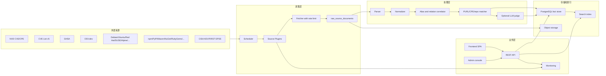

# VulTrack 漏洞追踪系统设计初稿

资料调研日期: 2026-05-07

## 1. 设计目标

VulTrack 的核心目标是把 NVD/CVE/GHSA/OSV/发行版 tracker/包管理器/厂商公告等多源数据统一到一个可查询、可关联、可审计、可持续更新的漏洞知识库中。

关键原则:

- 原始数据永不覆盖: 每次抓取结果进入 `raw_source_documents`，后续规范化和关联只引用原始数据 ID。
- 插件化采集: 漏洞源、tracker、包管理器、CPE 字典、EPSS/KEV 等全部作为独立 Source Plugin。
- 规范化不丢字段: 公共字段入结构化表，源特有字段保留在 `source_specific` JSONB。
- 先确定身份，再做匹配: 漏洞以 identifier graph 聚合，组件以 PURL/CPE/repo/name alias 聚合。
- 可用性优先: 每个插件都有 checkpoint、重试、死信、限速、健康检查、监控指标和审计日志。
- 搜索独立优化: PostgreSQL 做事实库，OpenSearch/Meilisearch/Typesense 做模糊搜索和 autocomplete，二者通过 outbox 同步。

## 2. 推荐技术栈

后端建议使用 Node.js/NestJS + TypeScript。原因是插件系统、队列、包管理器元数据解析、GitHub/npm/PyPI/Maven 等生态客户端更顺手。若团队更熟 .NET Core，也可以用 ASP.NET Core + Worker Service + Hangfire/Quartz 实现同样架构。

建议组件:

- API: NestJS REST API, OpenAPI/Swagger, JWT/OIDC。
- Worker: BullMQ/Redis 或 Temporal。若要求强工作流和可追溯，优先 Temporal。
- DB: PostgreSQL 16+，JSONB、分区、GIN、pg_trgm、全文索引。
- Search: OpenSearch 或 Meilisearch。百万级记录、复杂过滤时偏 OpenSearch；部署简单和模糊搜索偏 Meilisearch。
- Cache/Queue: Redis 或 NATS/RabbitMQ。
- Object Storage: MinIO/S3，可保存大体积原始压缩文件、SBOM、抓取快照。
- Observability: OpenTelemetry + Prometheus + Grafana + Loki/ELK。
- 部署: Docker Compose 起步，后续 Helm Chart/Kubernetes。

## 3. 总体架构



## 4. 数据流和业务逻辑

1. Source Plugin 根据 checkpoint 拉取增量数据，写入 `raw_source_documents`，以 `source_id + external_key + content_hash` 去重。
2. Parser 把源格式转换为内部 `VulnerabilityRecord`、`AffectedPackage`、`RegistryPackage`、`CpeEntry`、`ThreatIntelRecord`。
3. Normalizer 统一字段: identifier、时间、严重性、CWE、引用、受影响组件、版本区间、修复版本、撤回状态。
4. Correlator 建立漏洞图: CVE/GHSA/OSV/USN/RHSA/DSA/ALAS 等通过 alias、reference、same CVE、OSV aliases、GHSA identifiers、人工确认关系合并到 `canonical_vulnerabilities`。
5. Matcher 建立组件图: PURL、CPE、registry package、GitHub repo、发行版包名通过规则、证据和人工确认映射到 `components`。
6. Version Resolver 使用生态专用比较器判断某 PURL/version 是否落入 affected range。
7. Search Projector 把 canonical 漏洞、组件、CPE/PURL、引用、包名、CWE、严重性、KEV/EPSS 投影到搜索索引。
8. API 和前端只读规范化层，不直接读外部源格式。管理员可查看原始数据和处理错误。

## 5. 公开漏洞源清单

优先级说明: P0 是第一阶段必须接入；P1 是很有价值的扩展；P2 是候选源，接入前需要再确认许可、接口稳定性和限速策略。

| 优先级 | 来源 | 类型 | 格式/API | 关键字段 |
|---|---|---|---|---|
| P0 | NVD CVE API 2.0 / Data Feeds | 通用漏洞库 | REST JSON, year/recent/modified feeds | CVE ID, status, descriptions, CVSS, CWE, configurations/cpeMatch, references, vendor comments, CISA KEV 字段 |
| P0 | NVD CPE Dictionary / CPE Match | CPE 官方字典 | XML/JSON feeds, `/cpes/`, `/cpematch/` | cpeName, part, vendor, product, version, deprecated, titles, refs, matchCriteriaId |
| P0 | CVE List v5 | CVE 官方记录 | GitHub JSON v5, CVE Services | cveMetadata, containers.cna/adp, affected, descriptions, metrics, problemTypes, references |
| P0 | GitHub Security Advisory Database | GHSA/生态漏洞 | REST/GraphQL, OSV repo | GHSA ID, CVE, identifiers, ecosystem/package, vulnerable ranges, patched version, CVSS v3/v4, CWE, EPSS, source_code_location |
| P0 | OSV.dev | 开源聚合漏洞库 | REST JSON, OSV schema | id, aliases, related, affected.package.purl, ranges, versions, severity, refs |
| P0 | CISA KEV | 已知被利用 | JSON/CSV | CVE, vendorProject, product, dateAdded, dueDate, requiredAction, ransomwareKnown |
| P0 | FIRST EPSS | 利用概率 | CSV/API | CVE, epss, percentile |
| P0 | Debian Security Tracker | 发行版 tracker | Git/text/web, OSV via OSV.dev | CVE, source package, release status, fixed version, urgency, notes, DSA/DLA |
| P0 | Ubuntu Security Tracker/USN/LSN | 发行版 tracker | OSV, OVAL, VEX, web | CVE/USN/LSN, package, release pocket, status, fixed version, priority |
| P0 | Red Hat Security Data | 企业发行版 | CSAF/VEX, OSV, OVAL, Security Data API | RHSA, CVE, product tree, purl, CPE, fix status, remediations, repo-to-CPE |
| P0 | Alpine SecDB | 发行版 tracker | JSON files | pkg, secfixes, CVE, branch/release |
| P0 | SUSE Security CSAF/VEX | 企业发行版 | CSAF 2.0 JSON | advisory, CVE, product tree, package, fixed/unfixed status |
| P1 | Fedora Bodhi/updateinfo | 发行版更新 | REST/updateinfo.xml | update/advisory, package builds, CVE, severity, fixed builds |
| P1 | Amazon Linux ALAS | 云发行版 | HTML/RPM updateinfo.xml | ALAS ID, CVE, severity, affected packages, fixed NEVRA |
| P1 | Oracle Linux ELSA/OVAL | 企业发行版 | OVAL, errata pages | ELSA, CVE, packages, severity, fixed versions |
| P1 | AlmaLinux Errata | RHEL 兼容发行版 | Errata API/OSV | ALSA/ALBA/ALEA, CVE, packages, fixed versions |
| P1 | Rocky Linux Errata | RHEL 兼容发行版 | OSV/errata | RLSA, CVE, packages, fixed versions |
| P1 | Arch Linux Security Tracker | 滚动发行版 | Web/HTML/RSS | ASA/AVG, CVE, package, affected/fixed version, severity |
| P1 | Gentoo GLSA | 源码发行版 | XML/RSS | GLSA, package atom, vulnerable/unaffected ranges, refs |
| P1 | FreeBSD VuXML | BSD | XML | vuln ID, package ranges, CVE refs |
| P1 | Go Vulnerability Database | Go 生态 | OSV HTTP API | GO ID, module, affected symbols, version ranges, refs |
| P1 | RustSec Advisory DB | Rust 生态 | TOML/OSV | RUSTSEC ID, crate, affected ranges, patched/unaffected, CVE aliases |
| P1 | PyPA Advisory Database / PyPI JSON | Python 生态 | OSV, PyPI JSON | PYSEC/GHSA/CVE, package, versions, vulnerabilities array |
| P1 | FriendsOfPHP Security Advisories | Composer 生态 | Git/YAML | package, CVE, affected constraints |
| P1 | NuGet Catalog | .NET 生态 | NuGet V3 catalog JSON | package id/version, deprecation, vulnerabilities(advisoryUrl/severity), repository/project URL |
| P1 | npm registry/GHSA malware | JS 生态 | registry JSON, GHSA | package metadata, repository, advisories, malware type |
| P1 | Maven Central | JVM 包元数据 | Solr REST, POM | groupId, artifactId, version, scm/url/developers/licenses |
| P1 | RubyGems API | Ruby 包元数据 | REST JSON | name, version, homepage_uri, source_code_uri, bug_tracker_uri |
| P1 | Packagist/Composer metadata | PHP 包元数据 | JSON metadata | vendor/name, source, dist, homepage, support, versions |
| P1 | crates.io index/API | Rust 包元数据 | sparse/git index, API | crate name, versions, repository, homepage, yanked |
| P1 | Android Security Bulletin | 平台公告 | web/OSV | ASB ID, CVE, component, severity, affected versions |
| P1 | Kubernetes Official CVE Feed | 平台/云原生 | OSV JSON | KUBE ID, CVE, affected versions, refs |
| P1 | Bitnami Vulnerability DB | 容器/应用 | JSON/OSV | component, CVE, fixed version |
| P1 | Chainguard/Wolfi/Photon OS | 容器发行版 | OSV/APK sec data | package, distro, CVE, fixed version |
| P2 | Cisco/Juniper/Fortinet 等厂商公告 | 设备/商业软件 | CSAF/API/web | advisory, CVE, product, fixed release |
| P2 | Microsoft MSRC | 商业软件 | CVRF/CSAF/API | CVE, product, KB, severity, exploitability |
| P2 | Apple/Adobe/Atlassian/GitLab/Jenkins/Drupal/WordPress | 厂商/应用生态 | API/web/RSS | advisory, CVE, affected product/package, fixed version |
| P2 | Sonatype OSS Index / Ecosyste.ms / Trivy DB | 聚合/补充 | API/Git | purl, CVE/GHSA, package metadata, repo metadata |

## 6. 规范化漏洞模型

核心表:

```text
sources
- id, name, kind, homepage_url, license, trust_level, enabled, plugin_name, config_json, created_at

source_sync_runs
- id, source_id, trigger, started_at, finished_at, status, checkpoint_before, checkpoint_after,
  fetched_count, parsed_count, upserted_count, error_count, logs_url

raw_source_documents
- id, source_id, sync_run_id, external_key, external_id, source_url, fetch_url,
  etag, last_modified_header, source_published_at, source_modified_at,
  content_type, storage_uri, payload_json, payload_text,
  sha256, size_bytes, fetched_at,
  raw_status, parse_status, normalize_status, integrate_status,
  is_deleted, is_withdrawn, is_duplicate, error_code, error_message

vulnerability_records
- id, source_id, raw_document_id, source_record_id, primary_identifier,
  title, description, status, published_at, modified_at, withdrawn_at,
  source_specific jsonb, confidence, created_at, updated_at

canonical_vulnerabilities
- id, primary_identifier, title, description, status,
  published_at, modified_at, withdrawn_at,
  max_cvss_score, severity_label, epss_score, epss_percentile,
  kev_date_added, known_ransomware, risk_score, created_at, updated_at
```

关联表:

```text
vulnerability_identifiers
- id, canonical_vuln_id, record_id, identifier_type, identifier_value,
  source_id, relation, confidence
  -- CVE, GHSA, OSV, PYSEC, RUSTSEC, GO, DSA, USN, RHSA, ALAS, GLSA 等

vulnerability_relations
- id, from_canonical_id, to_canonical_id, relation_type, source_id, evidence_json, confidence
  -- same_as, alias_of, duplicate_of, related_to, supersedes, split_from, disputed

vulnerability_references
- id, canonical_vuln_id, record_id, url, ref_type, tags, source_id

vulnerability_severities
- id, canonical_vuln_id, record_id, source, system, vector, score, severity, version
  -- CVSS_V2, CVSS_V3_0, CVSS_V3_1, CVSS_V4_0, vendor severity

vulnerability_weaknesses
- id, canonical_vuln_id, cwe_id, source_id, description

affected_packages
- id, canonical_vuln_id, record_id, component_id,
  package_ecosystem, package_name, package_namespace, purl,
  distro_name, distro_release, package_format,
  introduced, fixed, last_affected, limit_version,
  range_type, version_range_raw, affected_versions_json,
  fixed_versions_json, affected_functions_json,
  environment_json, source_specific jsonb, confidence
```

## 7. 组件、PURL、CPE 和名称映射

组件 ID 不直接使用名称，避免改名、fork、同名包冲突:

```text
component_code = "cmp:" + base32(sha256(identity_type + "\0" + normalized_identity))[0:26]
```

`identity_type` 的优先级:

1. package: 使用规范化 PURL without version，例如 `pkg:maven/org.apache.logging.log4j/log4j-core`。
2. repository: 使用规范化 GitHub repo URL，例如 `github.com/apache/logging-log4j2`。
3. cpe-product: 使用 `cpe:2.3:a:vendor:product:*:*:*:*:*:*:*:*` 的 vendor/product 级 identity。
4. generic-name: 只作为低置信候选，不自动合并。

核心表:

```text
components
- id, component_code, canonical_name, component_type, homepage_url, description, created_at

component_identities
- id, component_id, identity_type, identity_value, normalized_value,
  is_primary, source_id, confidence, evidence_json

registry_packages
- id, ecosystem, registry_url, namespace, name, normalized_name,
  purl_type, purl_without_version, latest_version,
  description, homepage_url, repository_url, issue_url,
  metadata_json, last_seen_at

purl_name_mappings
- id, purl_type, registry, namespace, name, normalized_name,
  package_manager_name, package_manager_namespace,
  ruleset_version, confidence

cpe_entries
- id, cpe23_uri, part, vendor, product, version, update, edition,
  language, sw_edition, target_sw, target_hw, other,
  titles_json, refs_json, deprecated, last_modified_at

component_cpe_mappings
- id, component_id, cpe_entry_id, mapping_status,
  mapping_method, confidence, evidence_json, reviewed_by, reviewed_at
  -- status: candidate, approved, rejected, obsolete

component_repository_mappings
- id, component_id, repository_host, owner, repo, normalized_url,
  mapping_status, mapping_method, confidence, evidence_json
```

PURL 生成规则:

| 生态 | PURL 例子 | 名称规范化 |
|---|---|---|
| Maven | `pkg:maven/org.apache.logging.log4j/log4j-core@2.17.1` | groupId/artifactId 保持大小写但比较时 lower |
| PyPI | `pkg:pypi/django@5.0.1` | PEP 503: lower, `_ . -` 合并为 `-` |
| npm | `pkg:npm/%40scope/name@1.2.3` | scope/name lower，保留 scope |
| NuGet | `pkg:nuget/Newtonsoft.Json@13.0.3` | 比较时 case-insensitive |
| RubyGems | `pkg:gem/rails@7.1.0` | lower |
| Cargo | `pkg:cargo/serde@1.0.0` | crates.io name |
| Composer | `pkg:composer/laravel/framework@10.0.0` | vendor/package lower |
| Go | `pkg:golang/github.com/gin-gonic/gin@1.9.1` | module path |
| Debian | `pkg:deb/debian/curl@7.74.0-1?arch=amd64&distro=debian-11` | source/binary 包分开保存 |
| RPM | `pkg:rpm/redhat/kernel@5.14.0?arch=x86_64&distro=rhel-9` | NEVRA 单独字段保存 |

CPE 到 PURL 映射策略:

- 强证据: NVD configuration 中 CVE 与 GHSA/OSV alias 同 CVE，且 GHSA/OSV 给出了 PURL，CPE 产品与 PURL 包同时出现在同一漏洞。
- 官方证据: Red Hat repo-to-CPE、CSAF product_tree 中同时有 CPE/PURL。
- 元数据证据: CPE title/vendor/product 与 registry package/repo 的名称、homepage、repository、license、description 相似。
- 版本证据: CPE version 和 registry/release version 有交集。
- LLM 证据: 只用于候选排序，不直接自动 approve。
- 人工审核: 低于阈值或影响面大的映射必须进入 review queue。

## 8. 包管理器名称和 GitHub 项目匹配

包到 GitHub 项目的匹配流程:

1. 从包元数据读取 repository、scm、homepage、bug tracker、source_code_uri、project_urls、POM scm、composer support.source 等字段。
2. URL 规范化: `git+https`、`ssh://git@`、`.git`、`/tree/*`、`/releases`、`/issues`、重定向、大小写统一。
3. 生成候选 `github.com/{owner}/{repo}`。
4. 评分:
   - repository/source_code 字段直指 GitHub: 0.95。
   - issue tracker 指向同 repo: +0.03。
   - homepage 指向 GitHub: 0.80。
   - package namespace/name 与 owner/repo 匹配: +0.05 到 +0.12。
   - tags/releases 覆盖包版本: +0.05。
   - README/description 明显不一致: -0.20。
5. 结果写入 `component_repository_mappings`，`>=0.90` 自动确认，`0.65-0.90` 待审核，低于 0.65 只保留候选。

## 9. 插件式更新服务

插件接口建议:

```ts
export interface SourcePlugin {
  id: string;
  version: string;
  capabilities: Array<"vulnerability" | "cpe" | "registry-package" | "threat-intel">;
  defaultSchedule: string;
  validateConfig(config: unknown): Promise<void>;
  plan(input: { checkpoint?: unknown }): Promise<FetchPlan>;
  fetch(item: FetchItem, ctx: FetchContext): AsyncIterable<RawDocument>;
  parse(doc: RawDocument, ctx: ParseContext): Promise<ParsedEnvelope[]>;
}
```

运行要求:

- 插件只负责抓取和解析，不直接写业务表。
- 抓取结果必须提供 stable `external_key`、`source_url`、`sha256`。
- 插件 checkpoint 只在整批成功后提交。
- 支持 ETag/Last-Modified/If-None-Match、分页、recent/modified feed、Git commit delta、RSS/Atom。
- 每个 source 有独立限速、并发、超时、重试、熔断、死信队列。
- 插件崩溃不影响 API 和其他插件。

关键日志和监控:

- fetch_started/fetch_succeeded/fetch_failed
- raw_saved/raw_duplicate/raw_changed
- parse_failed/schema_invalid
- normalize_failed/version_range_invalid
- correlate_alias_conflict
- mapping_candidate_created/mapping_auto_approved/mapping_review_required
- index_projected/index_failed
- 指标: lag_seconds、last_success_at、docs_per_min、error_rate、retry_count、dead_letter_count、source_record_count、index_lag。

## 10. LLM 的适度引入

LLM 适合做“辅助判断”，不适合做权威来源。

使用场景:

- 判断 description 中的产品名、模块名、repo 名是否与候选 PURL/CPE 一致。
- 在 CPE vendor/product 和包名差异较大时给出证据摘要。
- 从非结构化 advisory 中抽取 affected product/version/fixed version 的候选字段。
- 识别“同名不同物”的误匹配风险。

安全边界:

- LLM 输出必须是 JSON schema: `{decision, confidence, evidence, uncertainty, cited_spans}`。
- 记录 `model_name`、prompt version、input hash、output、成本、时间。
- 不能直接写 approved mapping，只能写 candidate/review。
- 对许可证敏感或私有 SBOM 数据可禁用外部 LLM，改用本地模型或规则。

## 11. 搜索和模糊匹配

PostgreSQL:

- `canonical_vulnerabilities` 按年份或 `published_at` 分区。
- `raw_source_documents` 按 `source_id + fetched_at` 分区，避免单表膨胀。
- ID 精确查询使用 btree: `identifier_type + identifier_value`。
- 名称模糊使用 `pg_trgm`: package name、component name、CPE vendor/product、repo full name。
- 描述检索使用 `to_tsvector('simple', title || description || identifiers)` 的 GIN。
- JSONB 字段只给常用路径建表达式索引。

搜索索引:

- `vuln_search_documents`: canonical_id, identifiers, title, description, aliases, cwe, refs, affected purls, cpes, package names, repo names, severity, epss, kev。
- 支持 typo tolerance、prefix search、facets: source/ecosystem/severity/year/kev/epss/cwe/status。
- 索引更新通过 outbox 表，失败可重放。

## 12. API 设计

认证:

- `POST /api/auth/login`
- `POST /api/auth/refresh`
- `GET /api/me`

漏洞:

- `GET /api/vulnerabilities?query=&ecosystem=&severity=&kev=&epssMin=&page=`
- `GET /api/vulnerabilities/{id}`
- `GET /api/vulnerabilities/{id}/records`
- `GET /api/vulnerabilities/{id}/raw`
- `GET /api/vulnerabilities/{id}/relations`
- `POST /api/vulnerabilities/{id}/relations`

组件和映射:

- `GET /api/components?query=&purl=&cpe=`
- `GET /api/components/{id}`
- `GET /api/components/{id}/vulnerabilities`
- `GET /api/mappings/cpe-purl?status=candidate`
- `POST /api/mappings/cpe-purl/{id}/approve`
- `POST /api/mappings/cpe-purl/{id}/reject`
- `GET /api/repositories/{host}/{owner}/{repo}/packages`

匹配和扫描:

- `POST /api/match/purl` 输入 PURL/version，返回漏洞命中。
- `POST /api/match/cpe` 输入 CPE，返回漏洞命中。
- `POST /api/sboms` 上传 CycloneDX/SPDX。
- `GET /api/sboms/{id}/findings`

数据源和任务:

- `GET /api/sources`
- `POST /api/sources/{id}/sync`
- `GET /api/sync-runs`
- `GET /api/sync-runs/{id}`
- `GET /api/dead-letters`
- `POST /api/dead-letters/{id}/retry`

系统:

- `GET /api/health`
- `GET /api/metrics`
- `GET /api/audit-logs`

## 13. 权限管理

建议 RBAC + 项目/组织作用域:

| 角色 | 权限 |
|---|---|
| Admin | 全部权限、配置源、管理用户、删除/重跑任务 |
| Source Maintainer | 配置和运行指定 Source Plugin、查看抓取错误 |
| Security Analyst | 查看漏洞、审核 CPE/PURL/repo 映射、调整关系 |
| Developer | 上传 SBOM、查看项目漏洞、导出报告 |
| Viewer | 只读搜索和详情 |
| CI Token | 只允许 SBOM 上传、PURL/CPE match、读取项目 findings |

必须有审计:

- 登录、Token 创建/撤销。
- source 配置变更。
- 手动批准/拒绝映射。
- 漏洞关系人工修改。
- SBOM 上传、删除、导出。

## 14. Docker 部署

第一阶段 Docker Compose:

```text
vultrack-api
vultrack-worker
vultrack-scheduler
vultrack-plugin-runner
postgres
redis
opensearch 或 meilisearch
minio
prometheus
grafana
loki
```

部署要求:

- 所有服务使用环境变量配置，支持 `.env`。
- 数据目录挂载 volume。
- API 启动执行 DB migration。
- Worker 可水平扩容，但每个 source 用分布式锁避免重复全量同步。
- 插件 runner 支持只读 rootfs、资源限制、网络限速、超时。
- 离线部署时支持导入预下载 feed 包。

## 15. MVP 阶段建议

阶段 1:

- 接入 NVD CVE 2.0、NVD CPE、OSV.dev、GHSA、CISA KEV、EPSS。
- 完成 raw table、规范化漏洞表、identifier graph、PURL match、基础搜索。

阶段 2:

- 接入 Debian、Ubuntu、Red Hat、Alpine、SUSE。
- 完成 CPE-PURL 候选映射、人工审核台、包元数据采集 npm/PyPI/Maven/NuGet。

阶段 3:

- 接入更多包生态和发行版。
- 增加 SBOM 上传、项目资产、持续监控、通知。

阶段 4:

- 引入 LLM 辅助映射和非结构化公告抽取。
- 提供插件 SDK、插件市场/目录、Kubernetes Helm 部署。

## 16. 关键参考源

- NVD CVE API 2.0: https://nvd.nist.gov/developers/vulnerabilities
- NVD Data Feeds: https://nvd.nist.gov/vuln/data-feeds
- NVD CPE Dictionary: https://nvd.nist.gov/products/cpe
- CVE List v5: https://github.com/CVEProject/cvelistV5
- CVE Record Format: https://cveproject.github.io/cve-schema/
- OSV schema: https://ossf.github.io/osv-schema/
- OSV.dev API/database: https://osv.dev/
- GitHub Global Security Advisories REST API: https://docs.github.com/en/rest/security-advisories/global-advisories
- GitHub Advisory Database repo: https://github.com/github/advisory-database
- CISA KEV catalog: https://www.cisa.gov/known-exploited-vulnerabilities-catalog
- FIRST EPSS data: https://www.first.org/epss/data_stats
- Debian Security Tracker: https://security-tracker.debian.org/
- Ubuntu OSV data: https://documentation.ubuntu.com/security/security-updates/osv/
- Ubuntu OVAL data: https://documentation.ubuntu.com/security/security-updates/oval/
- Ubuntu VEX data: https://documentation.ubuntu.com/security/security-updates/vex/
- Red Hat Security Data: https://access.redhat.com/security/data
- Red Hat CSAF/VEX guidelines: https://redhatproductsecurity.github.io/security-data-guidelines/csaf-vex/
- SUSE CSAF: https://www.suse.com/support/security/csaf/
- Alpine SecDB: https://secdb.alpinelinux.org/
- Arch Security Tracker: https://security.archlinux.org/
- Gentoo GLSA: https://security.gentoo.org/glsa/
- Amazon Linux ALAS: https://docs.aws.amazon.com/linux/al2023/ug/alas.html
- Oracle Linux Security: https://linux.oracle.com/security/
- PyPI JSON API: https://docs.pypi.org/api/json/
- PyPI Index API: https://docs.pypi.org/api/index-api/
- npm Registry API: https://api-docs.npmjs.com/
- Maven Central REST API: https://central.sonatype.org/search/rest-api-guide/
- NuGet V3 Catalog API: https://learn.microsoft.com/en-us/nuget/api/catalog-resource
- RubyGems API: https://guides.rubygems.org/rubygems-org-api/
- RubyGems spec metadata: https://guides.rubygems.org/specification-reference/
- Packagist: https://packagist.org/
- Go Vulnerability Database: https://go.dev/doc/security/vuln/database
- RustSec Advisory DB: https://github.com/rustsec/advisory-db
- PURL specification ECMA-427: https://ecma-tc54.github.io/ECMA-427/multipage/purl-specification.html
